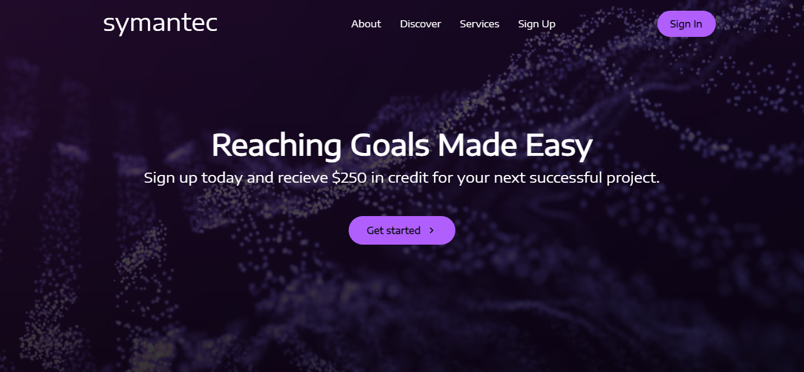
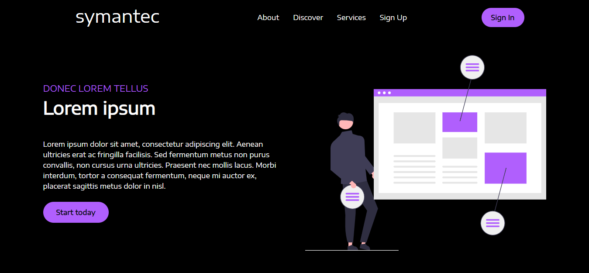
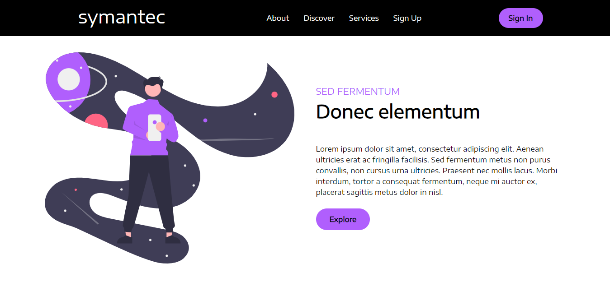
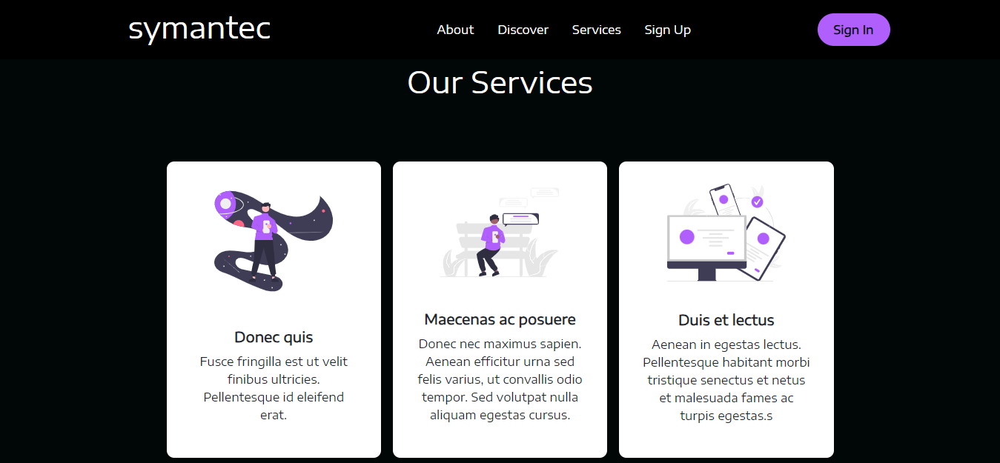
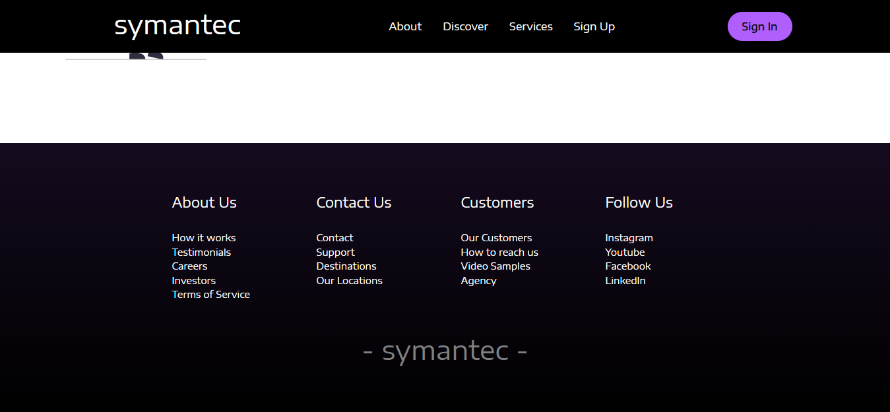

# Sample Business Website

This repository contains the source code for a sample business website. It is a responsive website designed for showcasing business information and services. It provides an engaging user experience and presents the company's offerings to potential clients.

Visit the application at [https://symantec.netlify.app/](https://symantec.netlify.app/).

## Tech Stack

This Sample Business Website is built using the following technologies:

- **React**: JavaScript library for building user interfaces.
- **HTML**: Markup language for creating the website structure.
- **CSS**: Styling language for designing the website layout and appearance.

## Table of Contents

- [Installation](#installation)
- [Usage](#usage)
- [Contributing](#contributing)
- [Screenshots](#screenshots)

## Installation

To install and run the project locally, follow these steps:

1. Clone the repository:
   git clone https://github.com/rabees/sample-business-website.git

2. Change to the project directory:
   cd simple-business-website

3. Install the dependencies:
   npm install

4. Start the development server:
   npm start

5. Open your web browser and visit `http://localhost:3000` to access the application.

## Usage

This simple business website showcases business information and services to potential clients. Users can navigate through different sections of the website to learn more about the company, its offerings, and get in touch.

## Contributing

Contributions are welcome! If you would like to contribute to this project, please follow these steps:

1. Fork the repository on GitHub.
2. Create a new branch from the `master` branch for your feature or bug fix.
3. Make your changes and commit them to your branch.
4. Push your changes to your forked repository.
5. Submit a pull request to the `master` branch of the original repository.

## Screenshots

Here are some screenshots showcasing the Sample Business Website:

1. **Homepage**: 
   _The homepage showcases key information about the company._

2. **About Section**: 
   _The about section provides a brief overview of the company's history and values._

3. **Discover Section**: 
   _The discover section highlights the company's services and areas of expertise._

4. **Services Section**: 
   _The services section provides detailed information about the company's offerings._

5. **Footer**: 
   _The footer section includes contact information and links to social media platforms._
